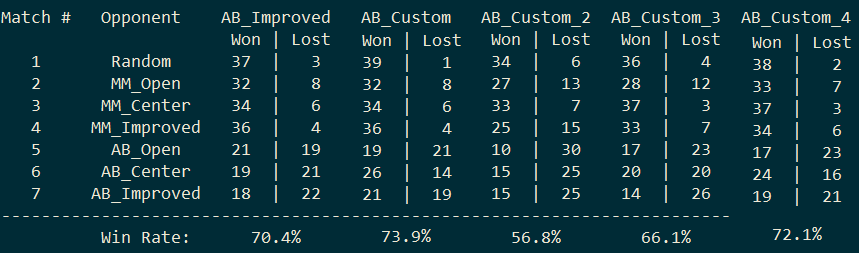

# Game-playing Agent for the "Isolation" game

## Introduction

In this project, we develop an adversarial search agent to play the game "Isolation". Isolation is a deterministic, two-player game of perfect information in which the players alternate turns moving a single piece from one cell to another on a board. Whenever either player occupies a cell, that cell becomes blocked for the remainder of the game. The first player with no remaining legal moves loses, and the opponent is declared the winner. These rules are implemented in the `isolation.Board` class provided in the repository.

This project uses a version of Isolation where each agent is restricted to L-shaped movements (like a knight in chess) on a rectangular grid (like a chess or checkerboard). The agents can move to any open cell on the board that is 2-rows and 1-column or 2-columns and 1-row away from their current position on the board. Movements are blocked at the edges of the board (the board does not wrap around), however, the player can "jump" blocked or occupied spaces (just like a knight in chess).

Additionally, agents have a fixed time limit each turn to search for the best move and respond. If the time limit expires during a player's turn, that player forfeits the match, and the opponent wins.

## Implementation

This project implements a minimax search with iterative deepening and alpha-beta pruning. 

## Heuristics

For this project I implemented several heuristics and compared them with the following game-playing agents in a round-robin tournament:

- Random: An agent that randomly chooses a move each turn.
- MM_Open: MinimaxPlayer agent using the open_move_score heuristic with search depth 3
- MM_Center: MinimaxPlayer agent using the center_score heuristic with search depth 3
- MM_Improved: MinimaxPlayer agent using the improved_score heuristic with search depth 3
- AB_Open: AlphaBetaPlayer using iterative deepening alpha-beta search and the open_move_score heuristic
- AB_Center: AlphaBetaPlayer using iterative deepening alpha-beta search and the center_score heuristic
- AB_Improved: AlphaBetaPlayer using iterative deepening alpha-beta search and the improved_score heuristic

### AB_Custom – Number of possible moves in the current and next turns

For each player, this heuristics calculates the sum of possible moves in the next two turns. The final score is the difference of the results obtained for each player.

Score = [Nb possible moves in next 2 turns for active player] – [Nb possible moves in next 2 turns for opponent player]

The idea behind this heuristics is to prevent the agent from selecting positions that do not allow any “escape”. 

###	AB_Custom2 – Number of blank cells in are around each player

This heuristics calculates the number of blank cells in a 5x5 area around the active player. Using this heuristics the agent will tend to move in areas with the highest number of blank cells. It will also stay away from the corners at the beginning of the game. 

Score = [number of blank cells in 5x5 area around player] - [number of blank cells in 5x5 area around opponent]

###	AB_Custom3 – Ratio

This heuristics combines different metrics seen in the previous heuristics

Score = [number of blank cells in 5x5 area around player] / [number of blank cells in 5x5 area around opponent] * len(current player moves)/ len(opponent player moves)

###	AB_Custom_4 – Weighted difference between player moves

This heuristics is given by:
Score = len(current player moves) – gamma*len(opponent player moves)
Where gamma is a positive coefficient.

The idea is to make the player more or less aggressive by adding some weight on the number of possible moves for the opponent player. If gamma is low, the player will focus on moves that open more possibilities for himself. If gamma is high, the player will tend to select moves that reduce the number of possible moves for the opponent.
I tried different values of gamma and found out that gamma=1.5 gives the best results.

## Tournament results

The first heuristics (using number of possible moves in the next two turns) outperforms the AB_improved player against the pre-defined agents. This is the heuristics that actually gets the best results overall.

The second heuristics does not get great results. This is most likely due to the fact that the player moves are complex (knight moves) so this heuristics is not capable of evaluating properly how many moves are actually possible in the close area around each player position. 

